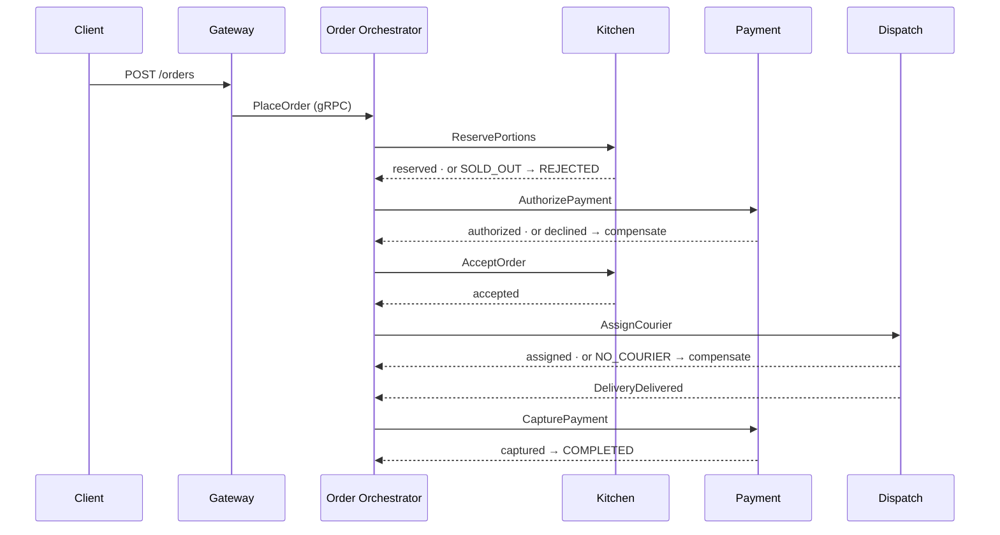
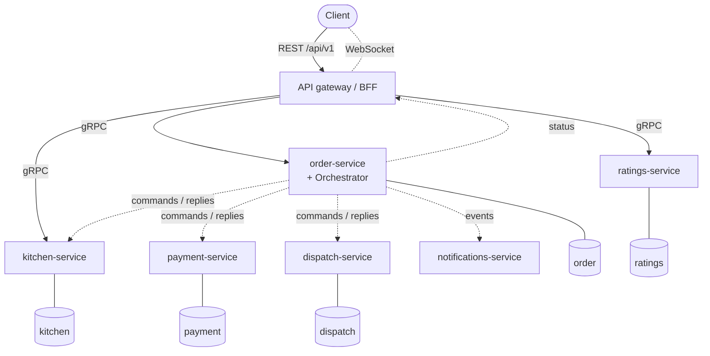

# HotDrop — Orchestration Saga

A NestJS + PostgreSQL backend for **HotDrop**, a marketplace of limited-batch chef
**"drops"** (a fixed number of portions of a dish for a delivery window), built as
**microservices coordinated by an orchestration-based saga**: a central **Order
Orchestrator** drives the order lifecycle — reserve portions → authorize payment → kitchen
accepts → assign courier → deliver → capture — as an explicit, durable state machine, with
**compensations** in reverse on any failure.

This repository is one implementation in a portfolio series that builds the **same domain
across several distributed architectures**, so the architectural differences stand out
against an unchanging domain. It is the **Orchestration Saga** edition and it **freezes the
REST contract** the siblings conform to; the siblings explore **Choreography Saga**,
**CQRS + Event Sourcing**, and **GraphQL Federation** over the same HotDrop domain.

> Runs locally only; it is never deployed. The domain is a vehicle for demonstrating
> distributed backend architecture, not a real business. External boundaries (payment,
> couriers, auth, notifications) are working **emulators**, not integrations.

---

## The domain

Independent kitchens publish **drops** — a limited batch of a dish for a delivery window.
Two ideas drive the model:

- **Scarcity is real.** A drop has a fixed number of portions; they **sell out**. Grabbing
  the last portions is genuine contention, resolved by an **atomic reservation** — the
  saga's first failable step.
- **An order is a distributed transaction.** Fulfilling it spans the kitchen (portions),
  payment, and a gig courier — services that each own their data. There is no two-phase
  commit; consistency is reached by a **saga** with explicit compensations.

### The order saga

Placing an order starts the saga. The orchestrator sends a command, awaits the reply, and
advances a **persisted** state machine — it never blocks on a reply, so it resumes cleanly
after a restart.



**Lifecycle:** `PLACED → PORTIONS_RESERVED → PAYMENT_AUTHORIZED → PREPARING →
COURIER_ASSIGNED → DELIVERED → COMPLETED`. The unhappy endings are **REJECTED** (sold out
at reservation — nothing acquired yet) and **CANCELLED** (a compensated mid-saga failure,
or a customer cancellation before preparation). **Compensations** run in reverse over the
resources acquired so far: unassign the courier → void the payment hold → release portions.

Portion **contention** ("two people grab the last portions") is resolved inside the
kitchen's own database: an atomic conditional decrement (`available >= qty`) serialized by
the row lock, backed by `CHECK` invariants, so a portion is never oversold.

---

## What "Orchestration Saga" means here

The order's distributed transaction has a **single conductor**. The `order-service` hosts
an **Order Orchestrator** that issues commands to the participants, collects their replies,
and decides the next step — or the compensations — from one explicit state machine. The
contrast with the choreography sibling is the whole point: there, no one is in charge and
the saga emerges from services reacting to each other's events.



Solid arrows are synchronous **gRPC**; dashed arrows are asynchronous **RabbitMQ**. What
this demonstrates:

- **Service per bounded context, database-per-service.** `gateway` (public edge, no DB),
  `order` (aggregate + orchestrator), `kitchen` (drops + portion inventory), `payment`
  (emulated), `dispatch` (emulated couriers), `ratings` (+ support), `notifications` (pure
  event reactor). Each owning service has its **own** PostgreSQL database — no shared
  tables, no cross-service joins; references are by id. The single Postgres container is
  local-convenience packaging; logically the databases are independent.

- **The saga runs over asynchronous messaging.** Commands (`ReservePortions`,
  `AuthorizePayment`, …) and replies travel as RabbitMQ messages, not blocking calls. The
  orchestrator persists saga state and reacts to replies, so a crash mid-saga resumes from
  the database rather than losing an in-flight call. Reliability is a **transactional
  outbox** (a message is written in the *same* local transaction as the state change) and
  an **inbox** (idempotent, exactly-once consume).

- **gRPC is the synchronous edge leg.** The gateway composes reads (browse drops, order
  status) and issues place/cancel/rate over typed gRPC to order / kitchen / ratings.
  payment and dispatch are reached **only** through the saga — never read by the edge.

- **A shared contracts package.** Saga command/reply schemas, domain events, broker
  topology, and the `.proto` live in `packages/contracts` (pure TS), so the wire shapes
  never drift between services. The outbox/inbox engine is a second shared package
  (`packages/messaging`) used through small per-service Prisma adapters.

---

## Key decisions & trade-offs (the honest part)

- **NestJS BFF, not an off-the-shelf gateway (Kong / Envoy).** Those are infra edge proxies
  (routing, TLS, rate-limit); they don't do the BFF **read-composition** this contract
  needs, so you'd still need a BFF behind them. The goal is to *design* the server, not to
  configure a third-party product.

- **The saga is async messaging, not blocking RPC.** Using request/response RPC for each
  step is shorter to write but couples step progress to a live in-memory call — a restart
  mid-step strands the saga. Outbox-published commands + a persisted state machine are the
  canonical, restart-safe form; gRPC is kept for the synchronous edge leg only.

- **No Redis.** Saga state and inbox de-duplication live in PostgreSQL — one source of
  truth, transactional with the handler. The only real contention (portion reservation) is
  an atomic update local to the kitchen; courier assignment has a single writer (the
  orchestrator), so there is no distributed lock to add. Restraint over a speculative
  dependency.

- **Tracing is correlated through the outbox.** Connecting an asynchronous saga into a
  single trace is **not** automatic — the relay publishes outside the originating request's
  context. The W3C trace context is captured on the outbox row and restored on consume, so
  one placed order is **one** Jaeger trace spanning every service.

- **Operational complexity is the honest price.** Seven processes + a broker + five
  databases run an order flow a single transaction could serve in a monolith. A saga earns
  its keep when the steps genuinely live in different services with different owners and
  failure modes — here it is, to a large degree, **ceremony for the sake of the
  demonstration**, and saying so is part of the point.

The notable decisions are recorded as they were made in the project's decision log.

---

## Project structure

A **Turborepo + pnpm-workspaces** monorepo — `apps/*` are deployable services,
`packages/*` is shared code:

```
apps/
├── gateway/               # public REST edge / BFF — frozen contract, auth, gRPC composition, WebSocket tracking
├── order-service/         # Order aggregate + Saga Orchestrator (durable state machine) · DB: order
├── kitchen-service/       # kitchens/drops/dishes + portion inventory (contention); drop reads (gRPC) · DB: kitchen
├── payment-service/       # emulated authorize/capture/void/refund (idempotent by order) · DB: payment
├── dispatch-service/      # emulated gig-courier assignment + delivery · DB: dispatch
├── ratings-service/       # ratings on completed orders + support tickets · DB: ratings
└── notifications-service/ # pure domain-event reactor (logs) — no database
packages/
├── contracts/             # saga commands/replies + domain events + broker topology + .proto — pure TS
├── messaging/             # transactional outbox relay + inbox guard over injectable ports
├── telemetry/             # OpenTelemetry bootstrap (NodeSDK + auto-instrumentations + OTLP → Jaeger)
├── eslint-config/         # shared flat ESLint config
└── typescript-config/     # shared tsconfig presets
e2e/                       # distributed black-box e2e against the running stack (incl. WebSocket tracking)
```

Each service owns its Prisma schema and migrations under `apps/<service>/prisma/`, with
cross-service references by id (no foreign keys across databases).

---

## Tech stack

TypeScript · NestJS 11 · Prisma 7 + PostgreSQL · **Turborepo + pnpm workspaces** ·
**RabbitMQ** (`@nestjs/microservices`, command/reply + events) · **gRPC** · **transactional
outbox/inbox** · **OpenTelemetry + Jaeger** · **WebSockets** (socket.io) · Docker Compose ·
Vitest · ESLint (flat) + Prettier.

---

## Getting started

Requires Node 24 (see `.nvmrc`), pnpm 11, and Docker.

```bash
cp .env.example .env        # local config (Postgres 5450, RabbitMQ 5673, Jaeger 4318/16686)
docker compose up -d        # PostgreSQL (one DB per service) + RabbitMQ + Jaeger
pnpm install
pnpm db:migrate             # apply each service's migrations to its own database
pnpm db:seed                # load demo kitchens + live drops
pnpm build && pnpm dev      # run every service in watch — gateway on http://localhost:4000
```

| Surface | URL | Notes |
|---|---|---|
| **Gateway API** | http://localhost:4000/api/v1 | send header `X-User-Id: <any id>` |
| **Swagger UI** | http://localhost:4000/docs | OpenAPI spec at `/docs-json` (frozen in `docs/openapi.json`) |
| **Jaeger** (tracing) | http://localhost:16686 | service `hotdrop-gateway` → open a trace to see the whole saga |
| **RabbitMQ** management | http://localhost:15673 | `hotdrop` / `dev` |
| **PostgreSQL** | `localhost:5450` | `hotdrop` / `dev`, one database per service |
| Health probes | `http://localhost:<4000–4006>/api/health` | gateway 4000, order 4001, kitchen 4002, payment 4003, dispatch 4004, ratings 4005, notifications 4006 |

> The Docker ports (Postgres **5450**, RabbitMQ **5673/15673**) are offset so this repo can
> run alongside its sibling implementations without a clash.

### Trying it out

Authenticated routes accept an emulated identity via the `X-User-Id` header, resolved at the
gateway. The seed loads two live drops you can order:

| Drop id | Kitchen | Portions | Price / portion |
|---|---|---|---|
| `drop-tonkotsu` | Ramen Lab | 20 | 1500¢ |
| `drop-al-pastor` | Taco Cartel | 12 | 1500¢ (tacos + horchata) |

```bash
curl localhost:4000/api/v1/drops                                   # browse live drops (public)

curl -X POST localhost:4000/api/v1/orders \
  -H 'Content-Type: application/json' -H 'X-User-Id: alice' \
  -d '{"deliveryAddress":"1 Main St","lines":[{"dropId":"drop-tonkotsu","qty":2}]}'

curl localhost:4000/api/v1/orders/<orderId> -H 'X-User-Id: alice'  # track to COMPLETED
```

Then open **Jaeger** and view that order as a single trace across all services. For live
updates, connect a socket.io client to `http://localhost:4000`, emit `track` with
`{ orderId }`, and listen for `status` events.

A ready-made **Bruno collection** in [`/bruno`](bruno) walks the whole vertical flow
(browse → place → track → rate → support) against the gateway; it is **stateful** (one
order), so the easiest way is Bruno's **Run** (collection runner). `pnpm db:seed` resets the
demo data for a clean slate.

---

## API contract

This project **freezes** the canonical REST contract for the series, exposed by the **gateway**. The
machine-readable artifact is committed at [`docs/openapi.json`](docs/openapi.json); an e2e
test builds the gateway's live `/docs-json` and verifies it matches **exactly** (same paths,
operations, and DTO schemas — zero drift). Conventions: global prefix `/api` with URI
versioning (`/api/v1/...`); `/api/health` is version-neutral; money is integer cents;
timestamps are ISO 8601; one error shape `{ statusCode, error, message, path, timestamp }`.

| Area | Endpoints |
|---|---|
| Drops | `GET /drops` · `GET /drops/:dropId` · `GET /drops/:dropId/ratings` |
| Orders | `POST /orders` · `GET /orders` · `GET /orders/:orderId` · `POST /orders/:orderId/cancel` |
| Ratings | `POST /orders/:orderId/ratings` |
| Support | `POST /support` |

Real-time order tracking is over **WebSockets** (outside the REST contract).

---

## Emulated boundaries

Peripheral mechanisms that are not the subject of the demo are **working proxies that
emulate behavior**, not dead stubs — swapping a fake for a real implementation is local to
the owning service:

- **Auth** (at the gateway) — accepts an `X-User-Id` header as the customer identity and
  forwards it downstream. No passwords, OTP, or sessions.
- **Payment** (`payment-service`) — authorize / capture / void / refund with simulated
  latency and a configurable decline rate (`PAYMENT_FAILURE_RATE`), idempotent by order.
- **Dispatch** (`dispatch-service`) — offers the order to candidate couriers with a
  configurable decline rate (`COURIER_DECLINE_RATE`); exhausting candidates yields
  `NO_COURIER`. Delivery auto-completes after a short delay.
- **Notifications** (`notifications-service`) — logs the "delivery" instead of sending.

The knobs double as a way to **exercise the compensations**: set `COURIER_DECLINE_RATE=1`
(or `PAYMENT_FAILURE_RATE=1`) and place an order — the saga compensates the work done so far
and the order ends `CANCELLED`, with the payment voided and the portions released.

---

## Testing

```bash
pnpm test        # unit + contract conformance
pnpm test:e2e    # distributed end-to-end against a running stack
```

- **Unit, framework-free** — the outbox relay and inbox guard (`packages/messaging`),
  exercised with in-memory fakes.
- **Contract conformance** (gateway e2e) — builds the gateway's `/docs-json` and asserts
  **exact** equality with the frozen `openapi.json` (routes, schema names, per-schema
  property sets).
- **Distributed end-to-end** (`e2e/`, black-box against the running stack) — the happy path
  through the gateway → all services + RabbitMQ to `COMPLETED` and a rating; the
  deterministic sold-out **REJECTED**; the auth (`401`) and validation (`400`) guards; and
  **WebSocket** tracking (status changes stream up to `COMPLETED`).

---

## Author

Vadim Stepanov — fullstack engineer.

- GitHub: [@vadim-stepanov](https://github.com/vadim-stepanov)
- LinkedIn: [linkedin.com/in/vadim-stepanov-98936150/](https://www.linkedin.com/in/vadim-stepanov-98936150/)
- Email: vadim.stepanov.mailbox@gmail.com

## License

MIT.
